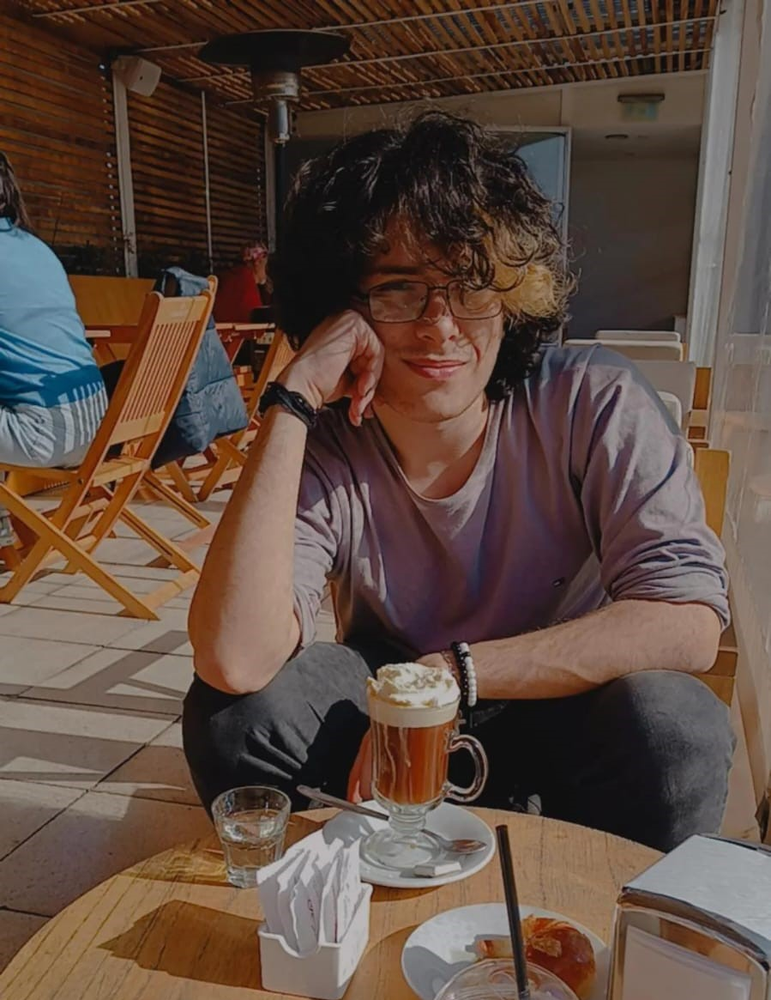

# Programación con objetos I
## Presentación Personal

### Datos Personales
- Mi nombre es Luciano Agustín Illuminati, tengo 22 años y soy de Hurlingham, Buenos Aires. Actualmente me encuentro cursando la Tecnicatura Universitaria en Programación, carrera en la que estoy enfocado en desarrollarme profesionalmente como programador.

- En el ámbito de la programación, me desempeño como desarrollador full stack, dedicando gran parte de mi tiempo a practicar y mejorar mis habilidades. Me interesa especialmente la resolución de problemas y la construcción de proyectos, ya que considero cada uno como un desafío que requiere lógica y creatividad.

<<<<<<< HEAD

=======

>>>>>>> 7d2a2c420688933c0ee3247afafc7a212c6a47d9

### Otra Información

- Además de la programación, tengo un gran interés por la ilustración digital. En mis tiempos libres realizo dibujos y busco perfeccionar mi técnica utilizando herramientas como Krita, Paint Tool SAI y Photoshop. También disfruto de los videojuegos y todo lo relacionado con la tecnología.

- Actualmente me encuentro en la búsqueda de mi primera oportunidad laboral en el área de programación, con el objetivo de adquirir experiencia, continuar formándome y desarrollarme profesionalmente.

- Este no es mi primer contacto con github. Tengo dos perros que se llaman Beto y Jazz
